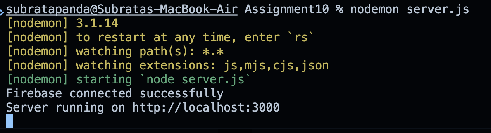
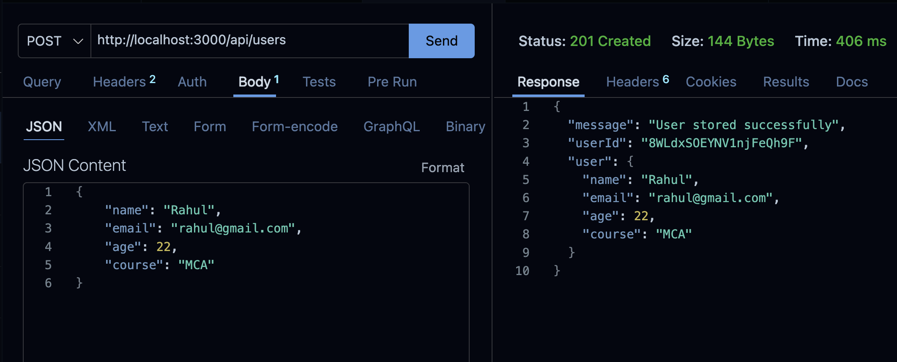
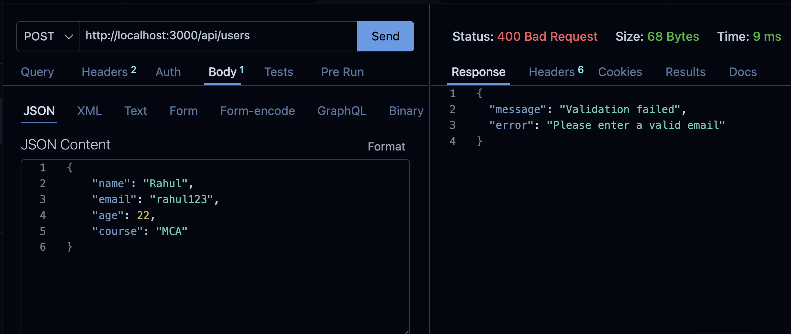
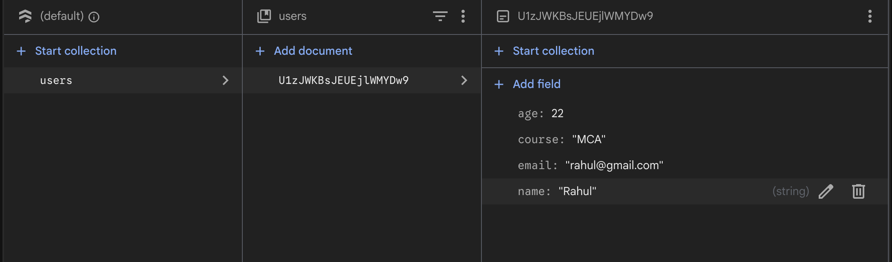

# Assignment 10 – Store Data in Firebase Firestore Using Express.js

## Problem Statement

Create an Express.js application that accepts user data through a POST request and stores it in Firebase Firestore.

The application validates the received user data using a schema before storing it in Firestore.

---

## Tech Stack

- Node.js
- Express.js
- Firebase Firestore
- Firebase Admin SDK
- Joi
- Thunder Client / Postman

---

## Folder Structure

```text
Assignment10/
├── server.js
├── config/
│   ├── firebase.js
│   └── serviceAccountKey.json
├── schema/
│   └── userSchema.js
├── router/
│   └── userRouter.js
├── screenshots/
├── .gitignore
├── package.json
├── package-lock.json
└── README.md
```

> `serviceAccountKey.json` contains private Firebase credentials and is excluded from Git using `.gitignore`.

---

## Setup & Installation

### 1. Initialize the project

```bash
npm init -y
```

### 2. Install required packages

```bash
npm install express firebase-admin joi
```

### 3. Start the server

```bash
node server.js
```

Expected terminal output:

```text
Firebase connected successfully
Server running on http://localhost:3000
```

---

## Firebase Connection

Firebase Firestore was configured using the Firebase Admin SDK and a Firebase service account.

The application successfully connects to the Firebase project.

### Screenshot – Firebase Connection



---

## API Endpoint

### 1. Create User

**Method:**

```text
POST
```

**Endpoint:**

```text
http://localhost:3000/api/users
```

### Request Body

```json
{
    "name": "Rahul",
    "email": "rahul@gmail.com",
    "age": 22,
    "course": "MCA"
}
```

### Successful Response

```json
{
    "message": "User stored successfully",
    "userId": "U1zJWKBsJEUEjlWMYDw9",
    "user": {
        "name": "Rahul",
        "email": "rahul@gmail.com",
        "age": 22,
        "course": "MCA"
    }
}
```

### Screenshot – Successful POST Request



---

## Schema Validation

The application validates user data before storing it in Firestore.

The following fields are validated:

| Field | Validation |
|---|---|
| Name | Required |
| Email | Required and valid email |
| Age | Required and between 1 and 100 |
| Course | Required |

---

## Validation Error

An invalid email was intentionally provided to test the validation.

### Request

```json
{
    "name": "Rahul",
    "email": "rahul123",
    "age": 22,
    "course": "MCA"
}
```

### Response

```json
{
    "message": "Validation failed",
    "error": "Please enter a valid email"
}
```

The API returns:

```text
400 Bad Request
```

### Screenshot – Validation Error



---

## Firestore Storage

After successful validation, the user data is stored in the Firestore collection:

```text
users
```

Firestore automatically generates a document ID for the stored user.

Example:

```text
users
└── U1zJWKBsJEUEjlWMYDw9
    ├── name: Rahul
    ├── email: rahul@gmail.com
    ├── age: 22
    └── course: MCA
```

### Screenshot – Data Stored in Firestore



---

## Application Flow

```text
POST /api/users
       ↓
Receive User Data
       ↓
Schema Validation
       ↓
    Valid?
    ↙     ↘
  No       Yes
  ↓         ↓
400 Error  Firestore
            ↓
      users Collection
            ↓
    Success Response
```

---

## Notes

- Joi is used for schema validation.
- Firebase Admin SDK is used to access Firestore.
- Valid user data is stored in the `users` collection.
- Invalid data is rejected before being stored.
- Firebase service account credentials are excluded from Git using `.gitignore`.

---

## Result

The Express.js application successfully:

- Connects to Firebase Firestore.
- Accepts user data through `POST /api/users`.
- Validates user data using Joi.
- Stores valid data in the Firestore `users` collection.
- Returns validation errors for invalid data.
- Returns a success response after storing the data.