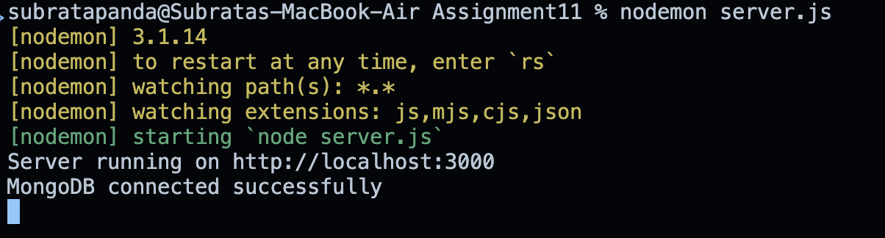
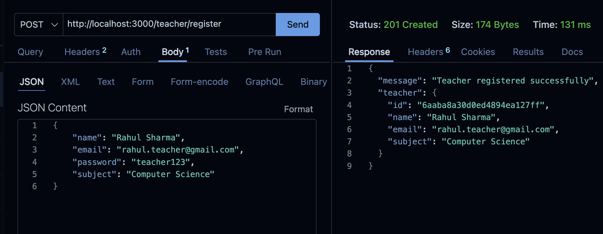
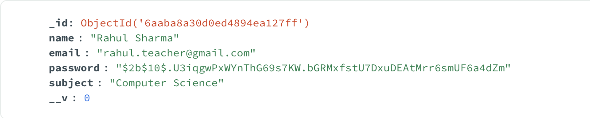
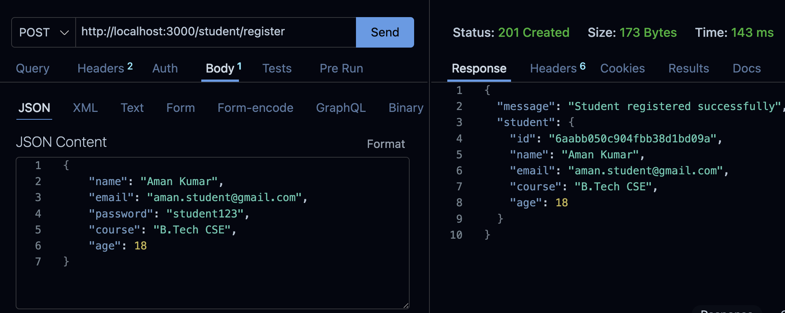
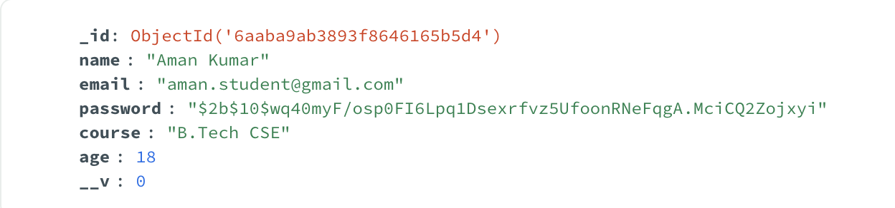
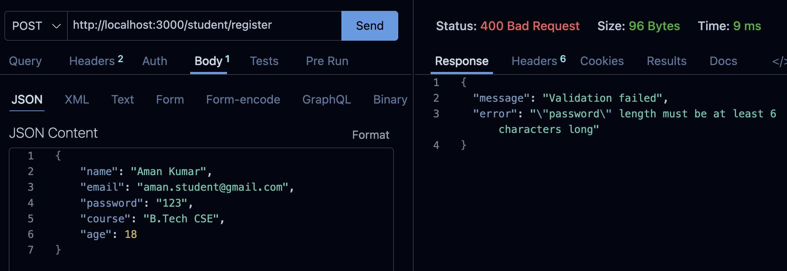

# Assignment 11 – Teacher and Student Registration Using Express.js and MongoDB

## Problem Statement

Create an Express.js application that allows teachers and students to register and store their details in a MongoDB database using Mongoose.

Separate schemas, models, and routers are created for teachers and students.

---

## Tech Stack

- Node.js
- Express.js
- MongoDB
- Mongoose
- Joi
- bcrypt
- Thunder Client / Postman

---

## Folder Structure

```text
Assignment11/
├── server.js
├── schema/
│   ├── teacherSchema.js
│   └── studentSchema.js
├── model/
│   ├── teacherModel.js
│   └── studentModel.js
├── router/
│   ├── teacherRouter.js
│   └── studentRouter.js
├── screenshots/
│   ├── mongodb-connected.png
│   ├── teacher-registration.png
│   ├── student-registration.png
│   ├── teacher-mongodb.png
│   ├── student-mongodb.png
│   └── validation-error.png
├── .gitignore
├── package.json
├── package-lock.json
└── README.md
```

---

## Setup & Installation

### 1. Initialize the project

```bash
npm init -y
```

### 2. Install required packages

```bash
npm install express mongoose bcrypt joi
```

### 3. Start MongoDB

```bash
mongosh
```

### 4. Start the Express server

```bash
node server.js
```

Expected terminal output:

```text
MongoDB connected successfully
Server running on http://localhost:3000
```

### Screenshot – MongoDB Connection



---

# Teacher Registration

## 1. Teacher Schema

The Teacher schema contains:

- Name
- Email
- Password
- Subject

## 2. Teacher Registration API

**Method:**

```text
POST
```

**Endpoint:**

```text
http://localhost:3000/teacher/register
```

### Request Body

```json
{
    "name": "Rahul Sharma",
    "email": "rahul.teacher@gmail.com",
    "password": "teacher123",
    "subject": "Computer Science"
}
```

### Successful Response

```json
{
    "message": "Teacher registered successfully",
    "teacher": {
        "id": "...",
        "name": "Rahul Sharma",
        "email": "rahul.teacher@gmail.com",
        "subject": "Computer Science"
    }
}
```

### Screenshot – Teacher Registration



---

## 3. Teacher Data in MongoDB

The registered teacher data is stored in the `teachers` MongoDB collection.

Example:

```text
name:     Rahul Sharma
email:    rahul.teacher@gmail.com
password: $2b$10$...
subject:  Computer Science
```

The password is stored in hashed form using bcrypt.

### Screenshot – Teacher Data



---

# Student Registration

## 1. Student Schema

The Student schema contains:

- Name
- Email
- Password
- Course
- Age

## 2. Student Registration API

**Method:**

```text
POST
```

**Endpoint:**

```text
http://localhost:3000/student/register
```

### Request Body

```json
{
    "name": "Aman Kumar",
    "email": "aman.student@gmail.com",
    "password": "student123",
    "course": "B.Tech CSE",
    "age": 18
}
```

### Successful Response

```json
{
    "message": "Student registered successfully",
    "student": {
        "id": "...",
        "name": "Aman Kumar",
        "email": "aman.student@gmail.com",
        "course": "B.Tech CSE",
        "age": 18
    }
}
```

### Screenshot – Student Registration



---

## 3. Student Data in MongoDB

The registered student data is stored in the `students` MongoDB collection.

Example:

```text
name:     Aman Kumar
email:    aman.student@gmail.com
password: $2b$10$...
course:   B.Tech CSE
age:      18
```

The password is stored in hashed form using bcrypt.

### Screenshot – Student Data



---

# Password Hashing

Passwords are hashed using **bcrypt** before being stored in MongoDB.

Example hashed password:

```text
$2b$10$...
```

The original password is not stored directly in the database.

---

# Validation

Registration data is validated before storing it in MongoDB.

For example, an invalid password with fewer than 6 characters produces a validation error.

### Example Request

```json
{
    "name": "Aman Kumar",
    "email": "aman.student@gmail.com",
    "password": "123",
    "course": "B.Tech CSE",
    "age": 18
}
```

### Response

```json
{
    "message": "Validation failed",
    "error": "\"password\" length must be at least 6 characters long"
}
```

Status:

```text
400 Bad Request
```

### Screenshot – Validation Error



---

# Application Flow

## Teacher

```text
POST /teacher/register
        ↓
Teacher Schema Validation
        ↓
Hash Password
        ↓
Teacher MongoDB Collection
        ↓
Success Response
```

## Student

```text
POST /student/register
        ↓
Student Schema Validation
        ↓
Hash Password
        ↓
Student MongoDB Collection
        ↓
Success Response
```

---

## Notes

- Mongoose is used to connect Express.js with MongoDB.
- Separate schemas, models, and routers are used for teachers and students.
- Joi is used for registration data validation.
- bcrypt is used to hash passwords before storing them.
- Teacher data is stored in the `teachers` collection.
- Student data is stored in the `students` collection.
- Passwords are never stored as plain text.

---

## Result

The Express.js application successfully:

- Connects to MongoDB using Mongoose.
- Registers teachers using `POST /teacher/register`.
- Registers students using `POST /student/register`.
- Validates registration data before storing it.
- Hashes passwords using bcrypt.
- Stores teacher and student data in their respective MongoDB collections.
- Returns appropriate success and validation error responses.