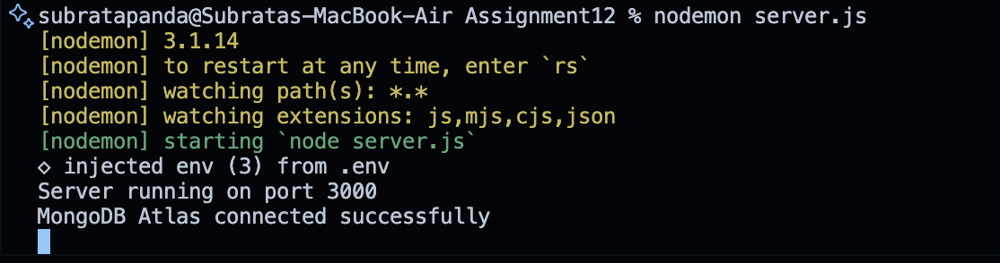
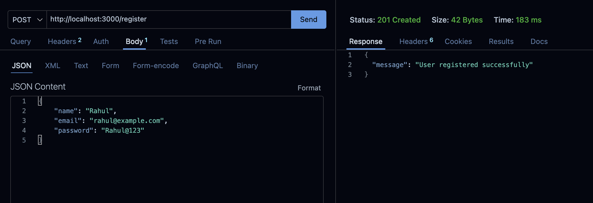
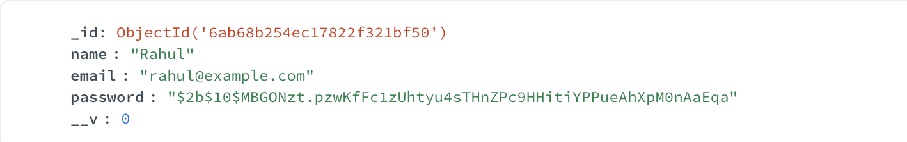
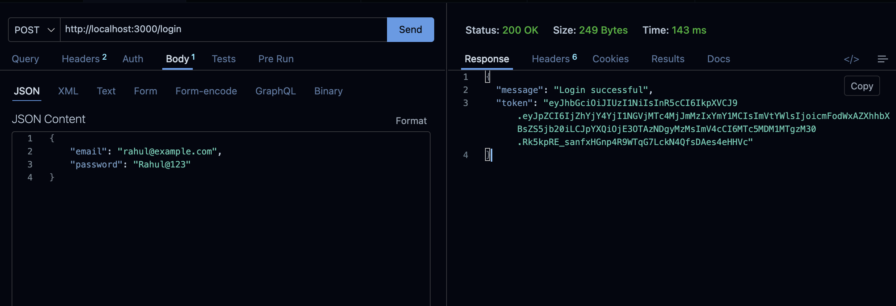
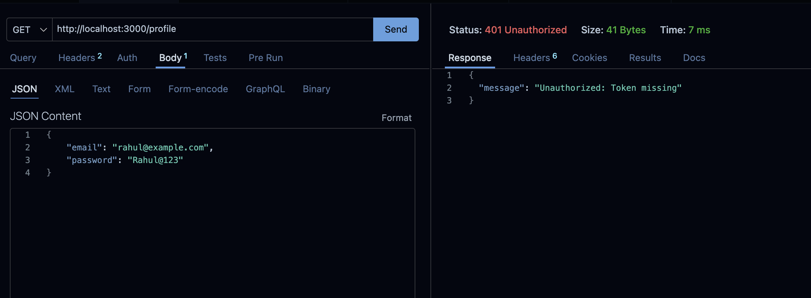
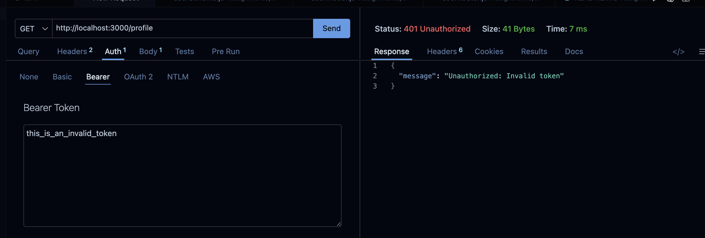
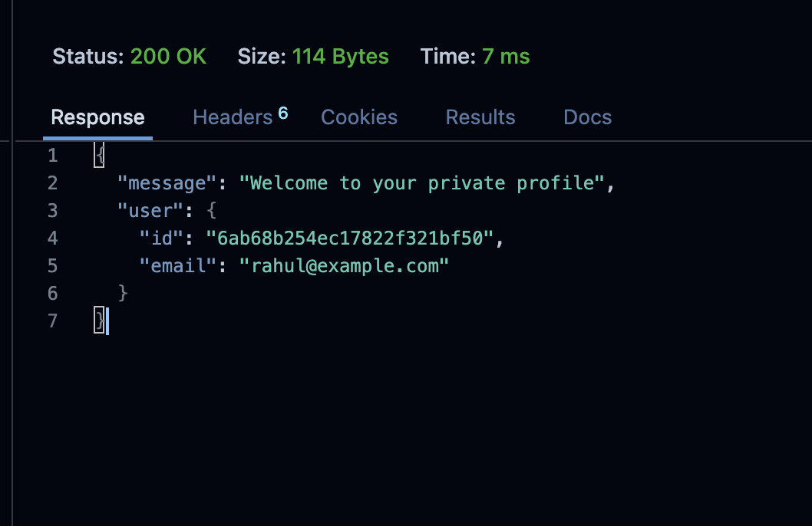

# Assignment 12 – User Registration, Login & JWT Authentication Using Express.js and MongoDB

## Problem Statement

Create a secure authentication system using **Node.js, Express.js, MongoDB Atlas, Mongoose, bcrypt, and JWT**.

The application allows users to:

- Register an account.
- Store their password securely using bcrypt.
- Login using their email and password.
- Receive a JWT token after successful login.
- Access a private `/profile` endpoint only when a valid JWT token is provided.

---

## Tech Stack

- Node.js
- Express.js
- MongoDB Atlas
- Mongoose
- bcrypt
- jsonwebtoken
- dotenv
- Thunder Client

---

## Folder Structure

```text
Assignment12/

├── config/
│   └── db.js
│
├── controllers/
│   └── authController.js
│
├── middleware/
│   └── authMiddleware.js
│
├── models/
│   └── User.js
│
├── routes/
│   └── authRoutes.js
│
├── screenshots/
│   ├── node-server.png
│   ├── register.png
│   ├── mongodb.png
│   ├── hash.png
│   ├── login.png
│   ├── jwt.png
│   ├── profile-no-token.png
│   ├── profile-invalid.png
│   └── profile-valid.png
│
├── .env.example
├── .gitignore
├── package.json
├── package-lock.json
├── README.md
└── server.js
```

---

## Setup & Installation

### 1. Initialize the project

```bash
npm init -y
```

### 2. Install required packages

```bash
npm install express mongoose bcrypt jsonwebtoken dotenv
```

### 3. Configure MongoDB Atlas

Create a MongoDB Atlas database and database user.

Create a `.env` file in the project root:

```env
MONGO_URI=your_mongodb_atlas_connection_string
JWT_SECRET=your_secret_key
PORT=3000
```

The actual `.env` file is not included in the repository because it contains private credentials and the JWT secret.

### 4. Run the Node.js Server

Using npm:

```bash
npm start
```

Or using Nodemon:

```bash
npx nodemon server.js
```

Expected terminal output:

```text
Server running on port 3000
MongoDB Atlas connected successfully
```



---

# User Registration

## 1. User Schema

The User schema contains:

- Name
- Email
- Password

The schema is created using **Mongoose**.

---

## 2. User Registration API

**Method:**

```text
POST
```

**Endpoint:**

```text
http://localhost:3000/register
```

### Request Body

```json
{
    "name": "Rahul",
    "email": "rahul@example.com",
    "password": "Rahul@123"
}
```

### Successful Response

```json
{
    "message": "User registered successfully"
}
```



---

## 3. User Data in MongoDB Atlas

After successful registration, the user is stored in the MongoDB Atlas `users` collection.

Example:

```text
name:     Rahul
email:    rahul@example.com
password: $2b$10$...
```



---

## 4. Hashed Password

The original password is never stored directly in MongoDB.

Example:

```text
$2b$10$...
```

The password is hashed using **bcrypt** before being stored.


---

# User Login

## 1. Login API

**Method:**

```text
POST
```

**Endpoint:**

```text
http://localhost:3000/login
```

### Request Body

```json
{
    "email": "rahul@example.com",
    "password": "Rahul@123"
}
```

The application:

- Finds the user using the email.
- Compares the entered password with the stored bcrypt hash.
- Rejects incorrect credentials.
- Generates a JWT when the credentials are correct.
- Returns the JWT token.

### Successful Response

```json
{
    "message": "Login successful",
    "token": "JWT_TOKEN_HERE"
}
```



---

## 2. JWT Token

A JWT token is generated after successful login.

The token is returned to the client and is used to access the protected `/profile` endpoint.


---

# Authentication Middleware

The authentication middleware protects private routes.

The middleware:

1. Reads the token from the request `Authorization` header.
2. Uses the **Bearer Token** format.
3. Verifies the token using the JWT secret.
4. Allows the request to continue if the token is valid.
5. Rejects the request if the token is missing or invalid.

Expected header:

```text
Authorization: Bearer JWT_TOKEN_HERE
```

---

# Private Profile Endpoint

## 1. Profile API

**Method:**

```text
GET
```

**Endpoint:**

```text
http://localhost:3000/profile
```

The `/profile` route uses the authentication middleware before accessing the private endpoint.

---

## 2. Profile Without Token

A request without an authentication token is rejected.

Expected status:

```text
401 Unauthorized
```



---

## 3. Profile With Invalid Token

An invalid JWT token is rejected.

Expected status:

```text
401 Unauthorized
```



---

## 4. Profile With Valid Token

A valid JWT token allows access to the private profile endpoint.

Expected status:

```text
200 OK
```

### Successful Response

```json
{
    "message": "Welcome to your private profile",
    "user": {
        "id": "USER_ID",
        "email": "rahul@example.com"
    }
}
```



---


# Application Flow

## Register

```text
POST /register

        ↓

Express Router

        ↓

Check Existing Email

        ↓

bcrypt.hash()

        ↓

MongoDB Atlas

        ↓

User Saved

        ↓

Success Response
```

## Login

```text
POST /login

        ↓

Find User by Email

        ↓

bcrypt.compare()

        ↓

Password Correct?

       /       NO  YES
      ↓    ↓
     401  Generate JWT

           ↓

       Return Token
```

## Private API

```text
GET /profile

        ↓

Authentication Middleware

        ↓

Read JWT Token

        ↓

jwt.verify()

       /       NO  YES
      ↓    ↓
     401  /profile

           ↓

      Private Response
```

---

## Notes

- **Mongoose** is used to connect Express.js with MongoDB Atlas.
- A separate **User schema and model** are used for storing user information.
- **bcrypt** is used to hash passwords before storing them.
- **jsonwebtoken** is used to generate and verify JWT tokens.
- **dotenv** is used to store the MongoDB connection string and JWT secret.
- The `/profile` endpoint is protected using authentication middleware.
- Passwords are never stored as plain text.
- The actual `.env` file is not included in the repository.
- `node_modules/` is excluded using `.gitignore`.
- **Thunder Client** is used for API testing.
