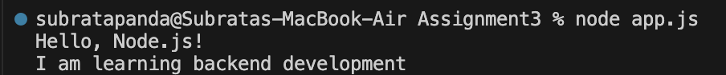
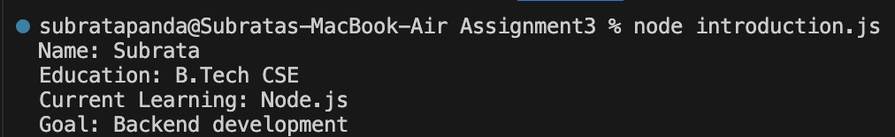

# NodeJS Basics Assignment

## Assignment Overview

This assignment introduces the basics of Node.js and JavaScript programming. The objective is to create basic Node.js programs, execute them using Node.js, and understand how JavaScript code runs in the terminal.

## Objectives

* Understand the basics of Node.js.
* Create and execute a Node.js program.
* Use `console.log()` to display output.
* Work with JavaScript variables.
* Understand how to run JavaScript files using Node.js.

---

# Task 1: First Node.js Program

## Description

The first task is to create a Node.js program that displays two messages in the terminal.

### File: `app.js`

```javascript
console.log("Hello, Node.js!");
console.log("I am learning backend development");
```

### Command Used

```bash
node app.js
```

### Output Screenshot



### Expected Output

```text
Hello, Node.js!
I am learning backend development
```

---

# Task 2: Simple Introduction Program

## Description

The second task is to create a Node.js program that displays personal information such as name, education, current learning, and career goal.

### File: `introduction.js`

```javascript
const name = "Subrata";
const education = "B.Tech CSE";
const currentLearning = "Node.js";
const goal = "Software Developer";

console.log("Name:", name);
console.log("Education:", education);
console.log("Current Learning:", currentLearning);
console.log("Goal:", goal);
```

### Command Used

```bash
node introduction.js
```

### Output Screenshot



### Expected Output

```text
Name: Subrata
Education: B.Tech CSE
Current Learning: Node.js
Goal: Software Developer
```

---

# Project Structure

```text
Assignment3
│
├── Screenshots
│   ├── task1.png
│   └── task2.png
│
├── app.js
├── introduction.js
└── README.md
```

---

# Commands Used

### Task 1

```bash
node app.js
```

### Task 2

```bash
node introduction.js
```
---
