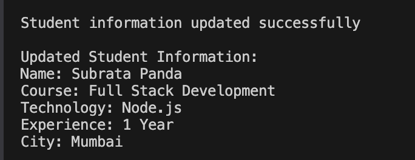
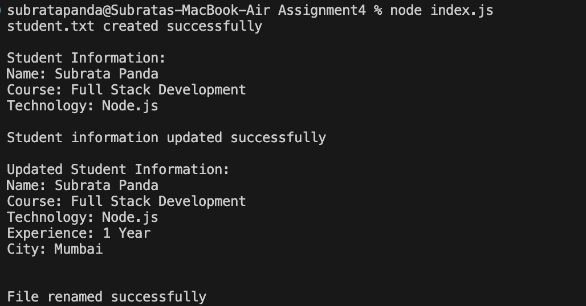

# Student File Management Using Node.js

## Assignment Overview

This project demonstrates basic file system operations using the built-in Node.js `fs` module.

The program performs the following operations:

1. Create a student information file
2. Read the student information
3. Update the existing file
4. Rename the file
5. Delete the file

---

## Technologies Used

* Node.js
* JavaScript
* Node.js `fs` Module

---

## Project Structure

```text
student-file-assignment/
│
├── index.js
├── package.json
├── README.md
├── task1.png
├── task2.png
├── task3.png
├── task4.png
└── task5.png
```

---

# Task 1: Create Student Information File

In this task, `fs.writeFile()` is used to create a file named `student.txt` and store the student information.

The file contains:

```text
Name: Subrata Panda
Course: Full Stack Development
Technology: Node.js
```

### Expected Result

The `student.txt` file should be created successfully.

### Output Screenshot


---

# Task 2: Read Student Information

In this task, `fs.readFile()` is used to read the contents of `student.txt`.

The complete student information is displayed in the terminal.

### Expected Result

```text
Student Information:
Name: Subrata Panda
Course: Full Stack Development
Technology: Node.js
```

### Output Screenshot


---

# Task 3: Update Student Information

In this task, `fs.appendFile()` is used to add additional information to the existing `student.txt` file.

The following information is added:

```text
Experience: 1 Year
City: Mumbai
```

The existing student information remains unchanged.

### Expected Result

```text
Updated Student Information:

Name: Subrata Panda
Course: Full Stack Development
Technology: Node.js
Experience: 1 Year
City: Mumbai
```

### Output Screenshot



---

# Task 4: Manage File Name

In this task, `fs.rename()` is used to change the file name.

The file is renamed from:

```text
student.txt
```

to:

```text
studentDetails.txt
```

### Expected Result

```text
File renamed successfully
```

### Output Screenshot



---

# Task 5: Remove File

In this task, `fs.unlink()` is used to delete the `studentDetails.txt` file.

### Expected Result

```text
studentDetails.txt deleted successfully
```

### Output Screenshot


---

# How to Run the Program

## Step 1: Open the Project Folder

Open the project folder in Visual Studio Code.

## Step 2: Open the Terminal

Open the integrated terminal in VS Code.

## Step 3: Run the Program

Run the following command:

```bash
node index.js
```

The program will perform all five file operations in sequence:

```text
Create File
    ↓
Read File
    ↓
Update File
    ↓
Rename File
    ↓
Delete File
```

---

# File System Methods Used

| Method            | Purpose                                                    |
| ----------------- | ---------------------------------------------------------- |
| `fs.writeFile()`  | Creates `student.txt` and writes student information       |
| `fs.readFile()`   | Reads and displays file content                            |
| `fs.appendFile()` | Adds additional information without removing existing data |
| `fs.rename()`     | Renames `student.txt` to `studentDetails.txt`              |
| `fs.unlink()`     | Deletes `studentDetails.txt`                               |

---

# Conclusion

This project demonstrates the use of the Node.js `fs` module for performing basic file system operations.

The program successfully:

* Creates a file
* Reads file contents
* Updates an existing file
* Renames a file
* Deletes a file
* Handles errors during file operations
