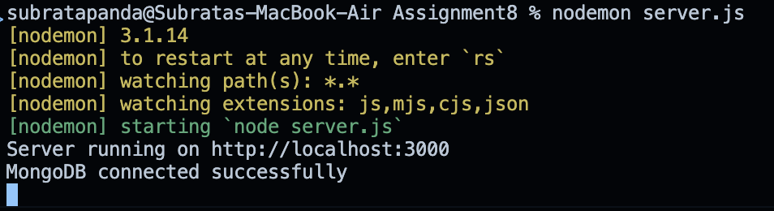
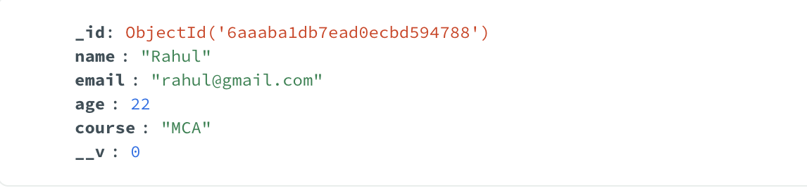
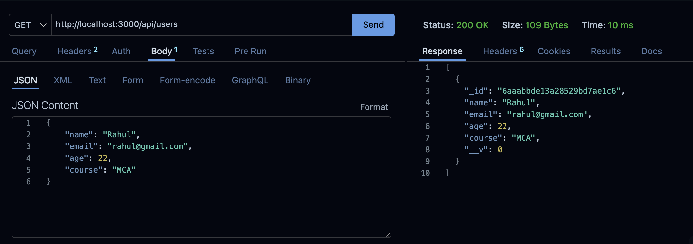

# Assignment 8 – User Management API

##  Overview

This project implements a simple User Management API using **Node.js, Express.js, MongoDB, and Mongoose**.

The application connects to a local MongoDB database and provides APIs to:

- Create and store a new user
- Retrieve all users from the database

The project follows a modular structure where the **schema, model, routing, and server configuration** are maintained in separate files.

---

##  Technologies Used

- Node.js
- Express.js
- MongoDB
- Mongoose
- Thunder Client
- MongoDB Compass

---

##  Project Structure

```text
Assignment8/
│
├── server.js
│
├── schema/
│   └── userSchema.js
│
├── model/
│   └── userModel.js
│
├── router/
│   └── userRouter.js
│
├── screenshots/
│
├── package.json
├── package-lock.json
└── README.md
```

### File Responsibilities

**`server.js`**  
Creates the Express server, enables JSON middleware, establishes the MongoDB connection, connects the router, and starts the server.

**`schema/userSchema.js`**  
Defines the structure of the user data.

**`model/userModel.js`**  
Creates the Mongoose User model using the defined schema.

**`router/userRouter.js`**  
Contains the API routes for creating and retrieving users.

---

##  Setup and Installation

### 1. Install Dependencies

Inside the project folder, install the required packages:

```bash
npm install express mongoose
```

### 2. Start MongoDB

Make sure the local MongoDB server is running.

The application uses the following MongoDB connection:

```text
mongodb://127.0.0.1:27017/assignmentdb
```

### 3. Start the Application

Run:

```bash
node server.js
```

The server runs on:

```text
http://localhost:3000
```

---

##  MongoDB Connection

Mongoose is used to connect the Express application to the local MongoDB database.

Database:

```text
assignmentdb
```

Collection:

```text
users
```

When the connection is successful, the terminal displays:

```text
MongoDB connected successfully
```

If the connection fails, an error message is displayed in the terminal.

---

##  User Data

The user schema contains the following fields:

| Field | Data Type |
|---|---|
| `name` | String |
| `email` | String |
| `age` | Number |
| `course` | String |

Example user:

```json
{
  "name": "Rahul",
  "email": "rahul@gmail.com",
  "age": 22,
  "course": "MCA"
}
```

---

##  API Endpoints

### 1. Create a User

**Method:** `POST`

**Endpoint:**

```text
http://localhost:3000/api/users
```

### Request Body

```json
{
  "name": "Rahul",
  "email": "rahul@gmail.com",
  "age": 22,
  "course": "MCA"
}
```

The API accepts the user information from the request body and stores it in MongoDB.

### Successful Response

```json
{
  "message": "User created successfully",
  "user": {
    "_id": "...",
    "name": "Rahul",
    "email": "rahul@gmail.com",
    "age": 22,
    "course": "MCA"
  }
}
```

---

### 2. Retrieve All Users

**Method:** `GET`

**Endpoint:**

```text
http://localhost:3000/api/users
```

This API retrieves all user documents stored in the MongoDB `users` collection.

### Example Response

```json
[
  {
    "_id": "...",
    "name": "Rahul",
    "email": "rahul@gmail.com",
    "age": 22,
    "course": "MCA"
  }
]
```

---

##  Screenshots

The following screenshots demonstrate the successful execution and working of the application.

### 1. MongoDB Connection

Terminal output showing that the application successfully connected to MongoDB.



---

### 2. Successful POST Request

Thunder Client showing the POST request used to create a new user and the successful response received from the server.


---

### 3. Data Stored in MongoDB

MongoDB Compass showing the `assignmentdb` database, `users` collection, and the user document stored after the POST request.



---

### 4. Successful GET Request

Thunder Client showing the GET request retrieving the users stored in MongoDB.




---

##  Implementation Notes

- Express is used to create the backend server and API routes.
- Mongoose is used for MongoDB connection and database operations.
- `express.json()` is used to process JSON request bodies.
- The user schema is defined separately from the model.
- The Mongoose model is defined separately from the router.
- The routing logic is maintained in `userRouter.js`.
- The schema and model are not defined directly inside `server.js`.
- The application uses the `/api` prefix for the user routes.

---

##  Result

The User Management API was successfully implemented with:

- MongoDB connection using Mongoose
- User schema and model
- User creation through `POST /api/users`
- User retrieval through `GET /api/users`
- Separate schema, model, router, and server files
- Successful verification of stored data in MongoDB