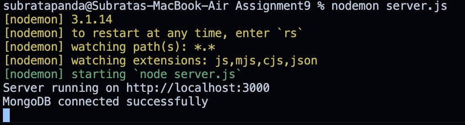
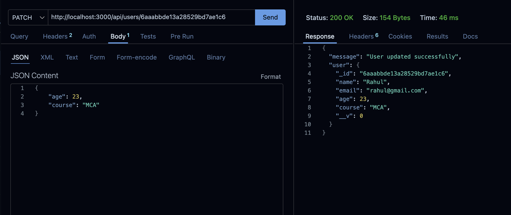
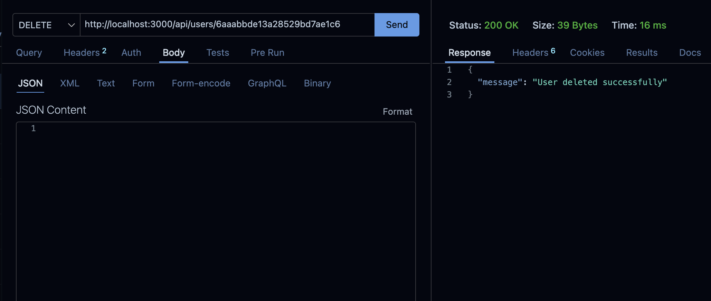

# Assignment 9 – Update and Delete Users (Express, MongoDB, Mongoose)

## Problem Statement

An Express.js application that connects to MongoDB using Mongoose and performs update and delete operations on existing user data.

The application uses separate files for the schema, model, routing logic, and server configuration.

## Tech Stack

- Node.js
- Express.js
- MongoDB
- Mongoose
- Thunder Client
- MongoDB Compass

## Folder Structure

```text
Assignment9/
│
├── server.js
├── schema/
│   └── userSchema.js
├── model/
│   └── userModel.js
├── router/
│   └── userRouter.js
├── screenshots/
└── README.md
```

## Setup & Installation

1. Install dependencies:

   ```bash
   npm install express mongoose
   ```

2. Make sure MongoDB is running locally.

3. The application connects to MongoDB using:

   ```text
   mongodb://127.0.0.1:27017/assignmentdb
   ```

4. Start the server:

   ```bash
   node server.js
   ```

5. Server runs at:

   ```text
   http://localhost:3000
   ```

## MongoDB Connection

The application connects to MongoDB using Mongoose in `server.js`.

On successful connection, the terminal displays:

```text
MongoDB connected successfully
```

### Screenshot – MongoDB Connection

Terminal output confirming a successful MongoDB connection.



## API Endpoints

### 1. Update User

**PATCH** `/api/users/:id`

The PATCH API updates an existing user's information using the MongoDB document ID.

Example:

```text
PATCH http://localhost:3000/api/users/68abc123...
```

Request Body:

```json
{
  "age": 23,
  "course": "MCA"
}
```

Successful Response:

```json
{
  "message": "User updated successfully",
  "user": { ... }
}
```

### Screenshot – Successful PATCH Request

Thunder Client request showing an existing user's information being updated.



### 2. Updated Data in MongoDB

After the PATCH request, the updated information can be verified in the MongoDB `users` collection.

Example:

```text
age: 23
course: MCA
```

### 2. Delete User

**DELETE** `/api/users/:id`

The DELETE API removes an existing user from MongoDB using the document ID.

Example:

```text
DELETE http://localhost:3000/api/users/68abc123...
```

Successful Response:

```json
{
  "message": "User deleted successfully"
}
```

###  Screenshot – Successful DELETE Request

Thunder Client request showing the successful deletion of an existing user.



### 4. Error Handling

The application handles common errors such as:

- Invalid MongoDB ID
- User not found
- Database errors
- Invalid request data

For an invalid ID:

```json
{
  "message": "Invalid user ID"
}
```

For a user that does not exist:

```json
{
  "message": "User not found"
}
```

## Notes

- Mongoose is used for MongoDB database operations.
- The existing schema is maintained in `schema/userSchema.js`.
- The Mongoose model is maintained in `model/userModel.js`.
- PATCH and DELETE routing logic is maintained in `router/userRouter.js`.
- Schema, model, and router logic are not defined directly inside `server.js`.
- MongoDB document IDs are used to identify users for update and delete operations.
- Appropriate HTTP status codes and messages are returned for error cases.


##  Result

The application successfully implements:

- MongoDB connection using Mongoose
- `PATCH /api/users/:id` for updating users
- `DELETE /api/users/:id` for deleting users
- Error handling for invalid IDs and missing users
- Proper separation of schema, model, router, and server files